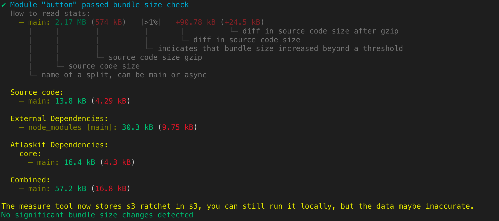

# Atlaskit Measure Tool

The Atlaskit measure tool is effectively a quick script to analyze the webpack bundle for a package. This is incredibly useful both to get the bundle size at-a-glance as well as when doing deep dives into bundle size.

For further details on how we measure the bundle size in Atlaskit, please read this [documentation](https://atlaskit.atlassian.com/docs/guides/bundle-size).

## Usage
```
    Usage
        $ measure <[paths]>

      Options
        --analyze               Opens bundle analyzer report
        --json                  Outputs measure stats as json
        --lint                  Lint mode fails build if size has been increased beyond threshold
        --updateSnapshot        Update measure snapshots
        --s3                    Run S3 flow

      Examples
        $ measure button badge
        $ measure button --updateSnapshot
        $ measure button --analyze
```

This prints output just to the terminal which will look like:



As you can see, we have split our code into different chunks to better understand where weight is. Most importantly, you can see if atlaskit, the code's own source, or external dependencies are the things weighing the package down.

The ratchet files are now stored into s3.

## Exceptions

It is important to know that we filter out some 'common packages' that are a cost that will be paid by almost everyone using atlaskit. Including these common packages in each output would distort information.

The excluded packages are:

- `react` 5.9kb (2.5kb)
- `react-dom` 96.5kb (30.9kb)
- `styled-components` 43.1kb (16kb)
- `tslib` 5.6kb (2kb)
- `prop-types` 829B (502B)

## Adding a new package or a new team folder in Atlaskit

Now that the ratchet are stored on s3, if you have to add a new package or a new team folder, you need to follow the below steps:
- If your adding a new team folder, 
  ** Find the custom build `push-bundle-size-to-s3` in the `bitbucket-pipelines.yml`.
  ** In the step name `Bundle size update for all other packages`, add your team folder name to the list `export input=`
- Rebase your branch on top of latest master.
- In Bitbucket, find your [branch](https://bitbucket.org/atlassian/atlaskit-mk-2/branches/).
- Click on the `...` and select from `Run pipeline for a branch` the custom build `push-bundle-size-to-s3`.
- Run the build

## A note on this package

The way this package is currently written it is **heavily** tied to the Atlaskit code-base. If you wish to use it elsewhere, we strongly recommend making sure you understand why each piece of the code exists when rolling your own version.
